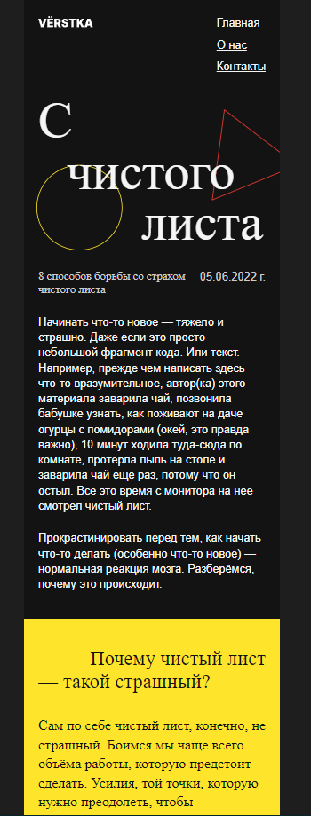
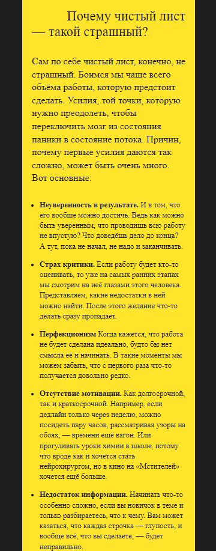
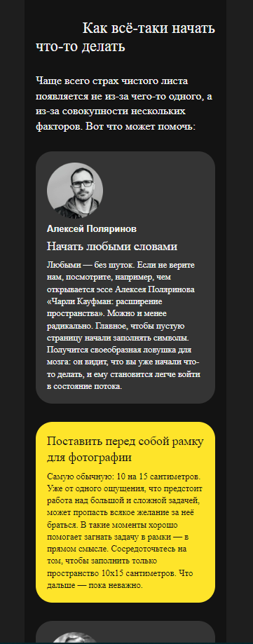

https://github.com/RiconCla/S_chistogo_lista.git
# Яндекс Практикум, проектная работа "С чистого листа"

## Оглавление

- [Запуск](#запуск)
- [Скриншоты](#скриншоты)
- [Описание](#описание)
- [Благодарность](#благодарность)

### Запуск

Достаточно перейти на [GitHub Pages](https://riconcla.github.io/S_chistogo_lista/)

### Скриншоты

### Описание

Небольшая страничка для рефлексии о изучении веб разработки, выполненный только для моб. разрешения. В данной работе упор был на семантике.

Использованные технологии: HTML, CSS, FLEX, BEM.

## Благодарность

Благодарю команду Яндекс Практикум за предоставление дизайна и уроков!